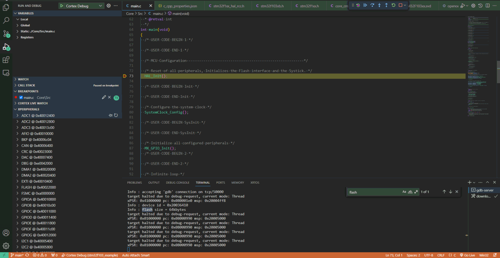
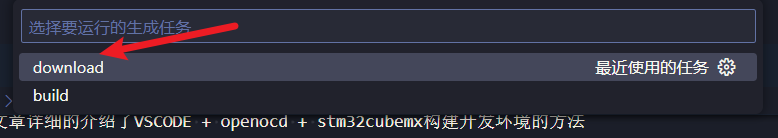

# stm32f103开发板仓库

## 开发环境的搭建

关于开发环境的搭建可以参考以下文章

https://sphinx-czc.readthedocs.io/zh/latest/%E5%BC%80%E5%8F%91%E6%9D%BF/stm32.html

上述文章详细的介绍了VSCODE + openocd + stm32cubemx构建开发环境的方法

同时还有stm32虚拟串口的介绍

开发板使用demo如下:



## 如何编译&下载

```
make -j
```

vscode 环境下快捷键

ctrl + shift + b

然后选择 `download`

